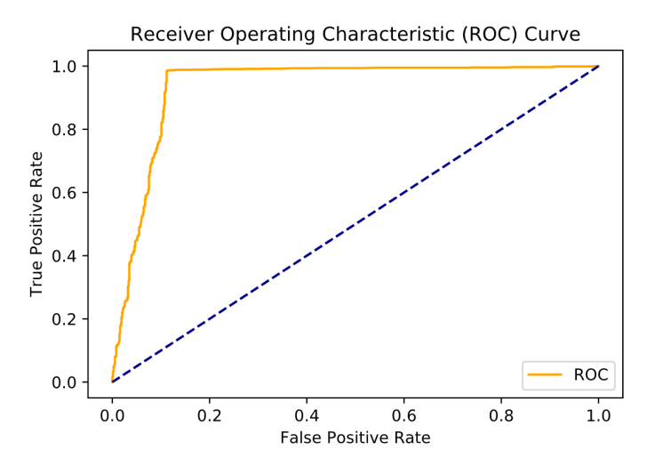

# similarity-modelling-2

## Students
Jakob Pinterits | 01327264

## Timesheet of Work

Date | Lecture | Task | Person
------------ | -------------  | ------------- | -------------
08.10.2019 | 09:00-12:00 | Attended lecture on SIM 1 | Pinterits & Wimmer
11.10.2019 | 09:00-12:00 | Attended lecture on SIM 1 | Pinterits
17.10.2019 | 13:00-16:00 | Attended lecture on SIM 2 | Pinterits & Wimmer
18.10.2019 | 09:00-12:00 | Attended lecture on SIM 2 | Pinterits & Wimmer
18.10.2019 | 12:00-16:00 | Set up IDE and build environment & Github | Pinterits & Wimmer
07.11.2019 | 16:00-20:00 | Extracting frames of videos | Pinterits
08.11.2019 | 18:00-22:00 | Labeling frames from videos | Wimmer
08.11.2019 | 22:00-23:00 | Setting up readme Github | Wimmer
09.12.2019 | 12.00-16:00 | Extract audio features from the videos; Train first models | Pinterits
22.12.2019 | 17.00-22:00 | Trying different sklearn classifiers & parameter tuning | Pinterits
28.12.2019 | 08:00-22:00 | Create a Pytorch Computer Vision Model | Wimmer
28.12.2019 | 22:00-06:00 | Train + Validate Model | Wimmer
29.12.2019 | 08:00-16:00 | Test Model + ROC + CM | Wimmer
16.01.2020 | 12:00-19:00 | Looking for better models for the audio based prediction | Pinterits
18.01.2020 | 08:00-19:00 | Create a Pytorch Transfer Learning Model + Test Model + ROC + CM | Wimmer
19.01.2020 | 08:00-19:00 | Create with Pytorch Data Augmentation  + Test Model + ROC + CMTest Model + ROC + CM | Wimmer
19.01.2020 | 15:00-18:00 | Fitting neural network to the audio data | Pinterits
20.01.2020 | 14:00-18:00 | Evaluation & preparing the submission | Pinterits

## Computer Vision

### Own Architecture

In this task we implement the architecture of our convolutional neural network.
In order to do so we create a class which inherits nn.Module and overwrite the
__init__ and the forward method.

In the __init__ function we define the layers of our networkk and the forward
function specifies how the input should pass through our layers - in other words
the architecture.

**Architecture**

We are goining to implement a simple 2-dimensional Convolutional Neural Network with 2 convolutional layers and 1 hidden fully connected layer and an output layer. We use a very simple network to be able to run our example in rather short time - but in the same manner all well known networks (AlexNet, VGG,...) can be rebuilt.

Similar to the image below:

Our convolutional layers should extract features from the images and the fully connected layers are used to classify the images.

The specifications we use in here are as follows:
* Conv1: out_channels=15, kernel_size=3, padding=1, stride=1 (image size stays the same with this config)
* Conv2: out_channels=30, kernel_size=3, padding=1, stride=1 (image size stays the same with this config)
* FullyConnected: out_features=100
* output: Calculate

Pooling: max-pooling with size 2 and stride 2

Activation: Rectified Linear Unit in hidden Layers and Softmax for output layer

Information about the different classes in the torch.nn module can be found here: <a href=https://pytorch.org/docs/stable/nn.html>toch.nn</a>

#### Plotting the Training Curve

As shown in the figure, the validation loss is increasing after epoch 6-7. Therefore, we decidet to evaluate our model from epoch 6 and 7. The following part deals with model epoch 7, because it achieved the highest accuracy of appr. 97% (1% better then model epoch 6). 

#### ROC Curve on test set

#### Classification Report

x | precision | recall | f1-score | support
------------ | -------------  | ------------- | ------------- | -------------
kirmet | 0.97 | 0.91 | 0.94 | 141
no kirmet | 0.96 | 0.99 | 0.98 | 325
accuracy |   |   | 0.97 | 466
macro avg | 0.97 | 0.95 | 0.96 | 466
weighted avg | 0.97 | 0.97 | 0.97 | 466

#### Confusion Matrix

### Transfer Learning

[by Clifford K. Yang](https://www.researchgate.net/figure/llustration-of-the-network-architecture-of-VGG-19-model-conv-means-convolution-FC-means_fig2_325137356)

The Output above shows the model architecture of the VGG-19 Model. We can see that the layers are groups in 3 Groups. The first group consists of Convolutional and Pooling Layers and is used to extract features (like the name suggests). The second group is a single Average Pooling Layer. The thrid and last layer is used to classify the images in the respective groups.

There are 3 fully connected Layers whereas the last the output layer is. We can see, that the last layer has 1000 Out-Features - this means that this model was trained to classify 1000 different classes. However, over task is only to classify between kirmet and not kirmet.

Therefore we have to change the last layer to only output 2 different out_features. This is done by getting the in_features (we could also just read them from above) and then changing the last layer with a new layer which has the same in_features but only out 2 out_features.

## Audio classification

For audio based prediction features have to be extracted from the data first. We
used librosa for this. Specifically, MFCCs were extracted from the data using
`librosa.feature.mfcc`. These are a very compact representation of the audio
that still contain enough information to use for machine learning.

Note that the goal is to predict whether kermit is visible in the frame, rather
than whether he's talking. Thus the MFCC window size was chosen to coincide with
the video's frames. A script then copied over the labels from the image
classification over to the audio data.

As MFCCs are already numeric only minimal preprocessing is necessary. Our
pipeline simply scales the data into the [0, 1] range via a MinMaxScaler.

The classification itself is performed via a Support Vector Machine. We've
tested multiple classifiers and tuned their parameters via GridSearch. SVC
turned out to be the best one:

Accuracy: 0.6169
Recall:   0.5850
F1:       0.6035

At first we were surprised that no classifier could get significantly over the
60% barrier. After some thought the result makes sense however:

  - there is frames where frames kermit is visible, but not talking
  - there is frames where kermit is not visible, but is talking

In short: We're trying to predict a circumstance that often simply isn't visible
from the data.

## Ensemble

The final model is an ensemble of both models implemented before. Both models
predict probabilities for each instance and their results are then averaged
together. Due to the visual model's superior performance it's results were
weighted much more strongly. Results are as follows:

Accuracy: 0.9542
Recall:   0.9860
F1:       0.9669

